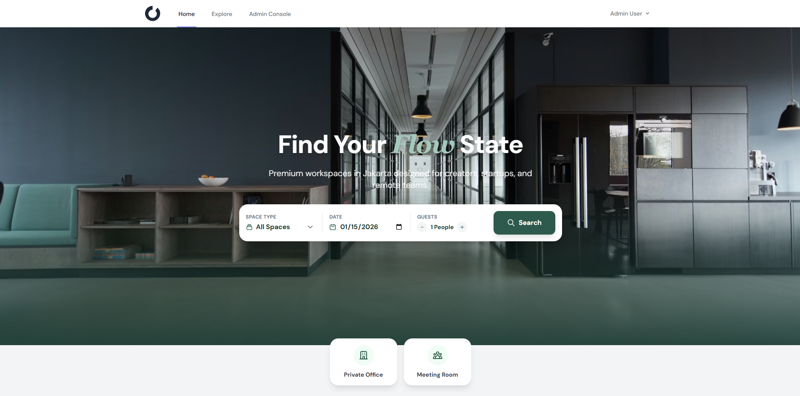
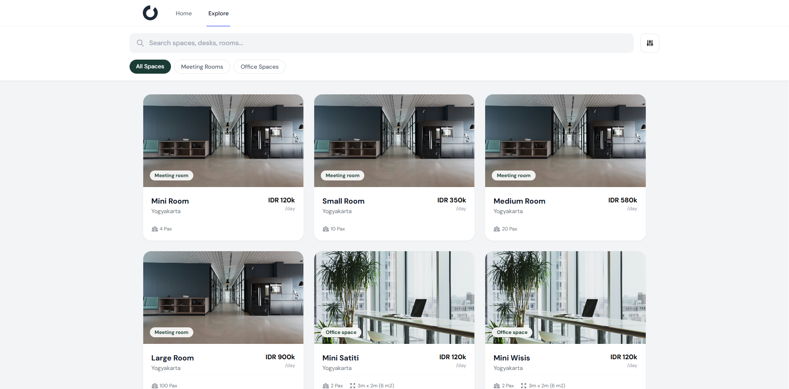
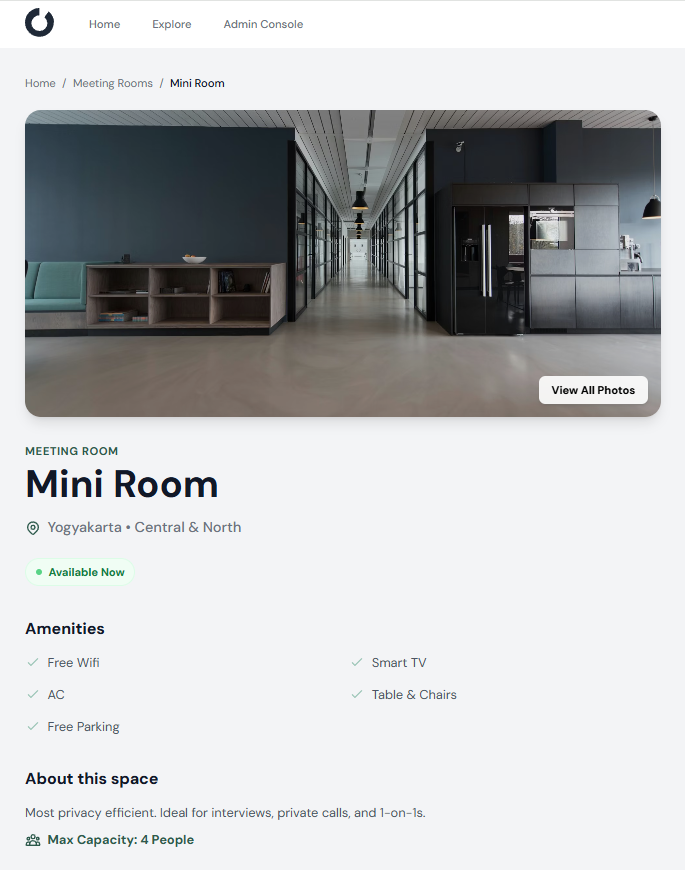
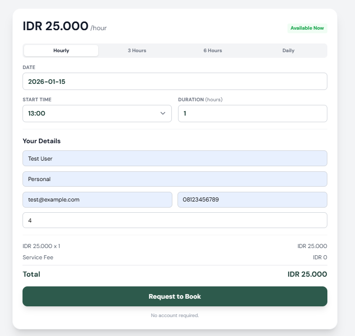
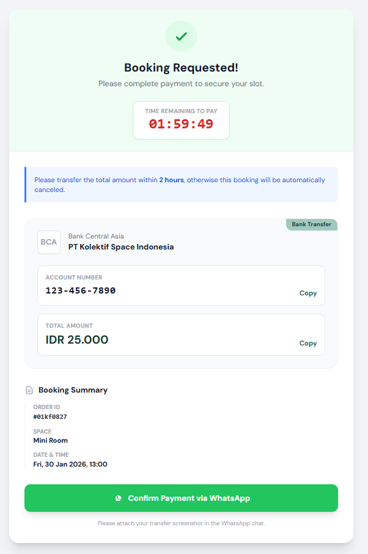
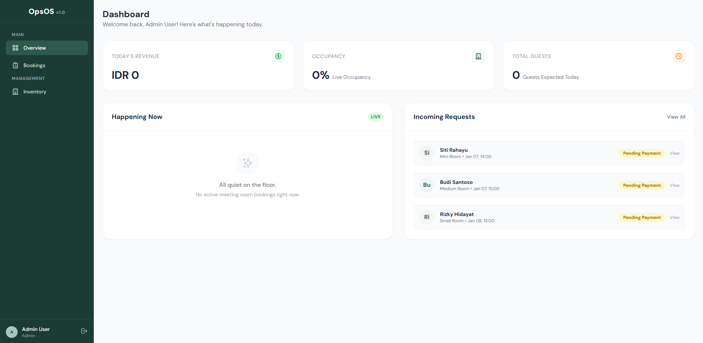

# Kolektif Space - Meeting Room Booking System

Kolektif Space adalah sistem pemesanan ruang meeting dan kantor berbasis web yang dibangun dengan Laravel 11. Aplikasi ini memungkinkan pengguna untuk menjelajahi, memesan, dan mengelola reservasi ruang kerja secara real-time dengan antarmuka yang modern dan responsif.

## Tech Stack

| Technology       | Description          |
| ---------------- | -------------------- |
| **Laravel 11**   | PHP Framework        |
| **MySQL**        | Database             |
| **Blade**        | Template Engine      |
| **Tailwind CSS** | Styling              |
| **Alpine.js**    | JavaScript Framework |
| **Vite**         | Build Tool           |
| **Flatpickr**    | Date Picker          |
| **SweetAlert2**  | Alert/Popup Library  |

## Fitur Utama

### Untuk Pengunjung (Guest)
- 🔍 **Jelajahi Ruangan** - Lihat semua meeting room dan office space yang tersedia
- 📅 **Booking Tanpa Login** - Pesan ruangan langsung tanpa perlu membuat akun
- 💳 **Transfer Bank Manual** - Pembayaran via transfer dengan konfirmasi WhatsApp
- ⏰ **Jam Operasional** - Pembatasan booking hanya pada jam 09:00-22:00
- 🔔 **Notifikasi Error** - Popup peringatan untuk konflik jadwal atau waktu di luar operasional

### Untuk Admin
- 📊 **Dashboard Overview** - Statistik revenue, occupancy, dan guest hari ini
- ✅ **Kelola Booking** - Approve atau cancel booking dengan satu klik
- 🔄 **Toggle Space** - Aktifkan/nonaktifkan ruangan
- 🔍 **Filter Booking** - Filter berdasarkan status dan ruangan
- ⚡ **Auto-Cancel** - Pembatalan otomatis booking pending setelah 3 jam

## Prasyarat (Prerequisites)

Pastikan software berikut sudah terinstal di komputer Anda:

| Software | Versi Minimum | Link Download                              |
| -------- | ------------- | ------------------------------------------ |
| PHP      | 8.2+          | [php.net](https://php.net)                 |
| Composer | 2.0+          | [getcomposer.org](https://getcomposer.org) |
| Node.js  | 18+           | [nodejs.org](https://nodejs.org)           |
| MySQL    | 8.0+          | [mysql.com](https://mysql.com)             |
| Git      | 2.0+          | [git-scm.com](https://git-scm.com)         |

> **Tip:** Gunakan [Laragon](https://laragon.org) (Windows) atau [Laravel Valet](https://laravel.com/docs/valet) (Mac) untuk setup yang lebih mudah.

## Instalasi dengan Laragon + TablePlus (Recommended untuk Windows)

### Tools yang Dibutuhkan

| Software      | Fungsi                            | Link Download                                |
| ------------- | --------------------------------- | -------------------------------------------- |
| **Laragon**   | Local Server (PHP, MySQL, Apache) | [laragon.org](https://laragon.org/download/) |
| **TablePlus** | Database GUI Manager              | [tableplus.com](https://tableplus.com/)      |
| **Node.js**   | JavaScript Runtime                | [nodejs.org](https://nodejs.org)             |

### Step 1: Install & Setup Laragon

1. Download dan install **Laragon Full** dari [laragon.org](https://laragon.org/download/)
2. Buka Laragon → klik **Start All** (akan menjalankan Apache & MySQL)
3. Laragon secara otomatis menyediakan:
    - PHP 8.x
    - MySQL 8.x
    - Composer
    - Git

### Step 2: Clone Project ke Laragon

```bash
# Buka terminal Laragon (klik kanan icon Laragon → Terminal)
cd C:\laragon\www
git clone https://github.com/yoo23-haidar/kolektifspacebooking.git
cd kolektifspacebooking
```

### Step 3: Buat Database dengan TablePlus

1. Buka **TablePlus**
2. Klik **"Create a new connection"** → pilih **MySQL**
3. Isi koneksi:
    - **Host**: `127.0.0.1`
    - **Port**: `3306`
    - **User**: `root`
    - **Password**: _(kosongkan)_
4. Klik **Connect**
5. Klik kanan di sidebar → **New Database** → Nama: `kolektifspace`

### Step 4: Install Dependencies

```bash
# Di terminal Laragon (folder project)
composer install
npm install
```

### Step 5: Konfigurasi Environment

```bash
# Copy file environment
copy .env.example .env

# Generate application key
php artisan key:generate
```

Edit file `.env` untuk koneksi database:

```env
DB_CONNECTION=mysql
DB_HOST=127.0.0.1
DB_PORT=3306
DB_DATABASE=kolektifspace
DB_USERNAME=root
DB_PASSWORD=
```

### Step 6: Jalankan Migrasi & Seeder

```bash
php artisan migrate
php artisan db:seed
```

### Step 7: Jalankan Aplikasi

```bash
# Terminal 1: Build frontend assets
npm run dev

# Terminal 2: Jalankan server (atau gunakan Pretty URL Laragon)
php artisan serve
```

### Step 8: Akses Aplikasi

| Halaman        | URL                                                         |
| -------------- | ----------------------------------------------------------- |
| Homepage       | http://localhost:8000 atau http://kolektifspacebooking.test |
| Explore Spaces | http://localhost:8000/explore                               |
| Admin Panel    | http://localhost:8000/admin                                 |

**Login Admin:**

-   Email: `admin@kolektif.com`
-   Password: `password`

> **Tips Laragon:** Aktifkan "Pretty URL" di Laragon untuk akses via `http://kolektifspacebooking.test` tanpa perlu `php artisan serve`

---

## Instalasi Manual (Alternatif)

### 1. Clone Repository

```bash
git clone https://github.com/yoo23-haidar/kolektifspacebooking.git
cd kolektifspacebooking
```

### 2. Install Dependencies

```bash
# Install PHP dependencies
composer install

# Install Node.js dependencies
npm install
```

### 3. Konfigurasi Environment

```bash
# Copy file environment
cp .env.example .env

# Generate application key
php artisan key:generate
```

### 4. Setup Database

Buat database baru di MySQL, lalu edit file `.env`:

```env
DB_CONNECTION=mysql
DB_HOST=127.0.0.1
DB_PORT=3306
DB_DATABASE=kolektifspace
DB_USERNAME=root
DB_PASSWORD=
```

### 5. Jalankan Migrasi & Seeder

```bash
# Jalankan migrasi database
php artisan migrate

# Isi data dummy (opsional, untuk testing)
php artisan db:seed
```

### 6. Build Assets & Jalankan Server

```bash
# Terminal 1: Build frontend assets
npm run dev

# Terminal 2: Jalankan server Laravel
php artisan serve
```

### 7. Akses Aplikasi

| Halaman        | URL                           |
| -------------- | ----------------------------- |
| Homepage       | http://localhost:8000         |
| Explore Spaces | http://localhost:8000/explore |
| Admin Panel    | http://localhost:8000/admin   |

**Login Admin:**

-   Email: `admin@kolektif.com`
-   Password: `password`

## Screenshots

### Homepage


_Halaman utama dengan hero section dan search bar untuk mencari ruangan_

### Explore Page


_Daftar semua ruangan yang tersedia dengan filter berdasarkan tipe_

### Space Detail


_Detail ruangan dengan informasi lengkap, harga, dan form booking_

### Booking Form


_Form pemesanan dengan pilihan tanggal, waktu, dan durasi_

### Payment Page


_Halaman pembayaran dengan instruksi transfer bank dan countdown timer_

### Admin Dashboard


_Dashboard admin dengan statistik revenue, occupancy, dan incoming requests_

### Admin Bookings


_Daftar semua booking dengan filter status dan ruangan_

## Struktur Folder Penting

```
kolektifspacebooking/
├── app/
│   ├── Console/Commands/     # AutoCancelBookings command
│   ├── Http/Controllers/
│   │   ├── Admin/            # Admin controllers
│   │   ├── BookingController.php
│   │   └── SpaceController.php
│   └── Models/               # Eloquent models
├── database/
│   ├── migrations/           # Database schema
│   └── seeders/              # Dummy data
├── resources/views/
│   ├── admin/                # Admin panel views
│   ├── booking/              # Booking & payment views
│   ├── layouts/              # Layout templates
│   └── space/                # Space detail view
└── routes/
    └── web.php               # All routes
```

## Konfigurasi Tambahan

### Auto-Cancel Scheduler (Production)

Tambahkan cron job untuk menjalankan scheduler Laravel:

```bash
* * * * * cd /path-to-project && php artisan schedule:run >> /dev/null 2>&1
```

### Build untuk Production

```bash
npm run build
php artisan config:cache
php artisan route:cache
php artisan view:cache
```

## License

This project is open-sourced software licensed under the [MIT license](https://opensource.org/licenses/MIT).

## Author

Made by [yoo23-haidar](https://github.com/yoo23-haidar)
