# System Diagrams - KolektifSpace

Dokumentasi visual untuk sistem booking ruang kerja KolektifSpace.

---

## 1. Context Diagram

Diagram konteks menunjukkan hubungan sistem dengan entitas eksternal.

```mermaid
flowchart TB
    subgraph External["External Entities"]
        Guest["👤 Guest<br/>(Pengunjung)"]
        Admin["👨‍💼 Admin<br/>(Pengelola)"]
    end
    
    subgraph System["🏢 KolektifSpace System"]
        App["Sistem Booking<br/>Ruang Kerja"]
    end
    
    Guest -->|"Melihat ruang,<br/>Membuat booking,<br/>Upload bukti bayar"| App
    App -->|"Info ruang,<br/>Konfirmasi booking,<br/>Status pembayaran"| Guest
    
    Admin -->|"Login,<br/>Kelola ruang,<br/>Approve/Cancel booking"| App
    App -->|"Dashboard,<br/>Laporan booking,<br/>Notifikasi"| Admin
```

---

## 2. Data Flow Diagram (DFD) Level 0

DFD Level 0 menunjukkan proses utama sistem.

---

## 3. Data Flow Diagram (DFD) Level 1 - Proses Booking

Detail proses booking.

---

## 4. Entity Relationship Diagram (ERD)

Diagram hubungan antar entitas database.

---

## 5. Flowchart - Proses Booking Guest

Alur lengkap proses booking dari perspektif guest.

---

## 6. Flowchart - Proses Approval Admin

Alur proses approval booking oleh admin.

---

## 7. Use Case Diagram

Diagram use case menunjukkan fungsionalitas sistem.

```mermaid
flowchart TB
    subgraph Actors
        Guest["👤 Guest"]
        Admin["👨‍💼 Admin"]
    end
    
    subgraph "KolektifSpace System"
        UC1["📋 Lihat Daftar Ruang"]
        UC2["🔍 Filter Ruang"]
        UC3["📄 Lihat Detail Ruang"]
        UC4["📝 Buat Booking"]
        UC5["💳 Upload Bukti Bayar"]
        UC6["🔐 Login"]
        UC7["📊 Lihat Dashboard"]
        UC8["✅ Approve Booking"]
        UC9["❌ Cancel Booking"]
        UC10["🏢 Kelola Ruang"]
        UC11["📈 Lihat Laporan"]
    end
    
    Guest --> UC1
    Guest --> UC2
    Guest --> UC3
    Guest --> UC4
    Guest --> UC5
    
    Admin --> UC6
    Admin --> UC7
    Admin --> UC8
    Admin --> UC9
    Admin --> UC10
    Admin --> UC11
```

---

## Legenda

| Simbol | Keterangan |
|--------|------------|
| `○` | External Entity (Aktor) |
| `□` | Proses |
| `▭` | Data Store |
| `→` | Aliran Data |
| `PK` | Primary Key |
| `FK` | Foreign Key |
| `UK` | Unique Key |
